<h1 align="center">Hi 👋, I'm Thamilini Gobalakrishnan</h1>
<h3 align="center">Full Stack Software Engineer Intern | Mobile · Backend APIs · Responsive Web Development</h3>

  

  <a href="https://github.com/tfamil" target="_blank">💻 GitHub</a> ·
  <a href="https://linkedin.com/in/gthamil/?utm_source=github.com&utm_medium=readme&utm_campaign=git-readme&utm_id=tfamil&utm_term=git-readme&utm_content=readme" target="_blank">💼 LinkedIn</a> ·
  <a href="mailto:thamilgobalakrishnan@gmail.com">📫 Email</a>

---

### 🌟 About Me

I'm a **BSc (Hons) Computer Science student** with hands-on full-stack internship and project experience across **mobile applications, backend APIs, and responsive web development**.

- 💼 Currently gaining software engineering experience as a **Full Stack Developer Intern at RISPIT Lanka**, contributing to the **SeatSnaps Organizer Platform** across Flutter mobile and web organizer workflows.
- ⚙️ Built backend services with **Node.js, TypeScript, Express, PostgreSQL, Prisma, Zod, and Jest**.
- 📱 Developed Android and Flutter applications using **Kotlin, Dart, Room/SQLite, Firebase Authentication, Cloud Firestore, sensors, QR scanning, and Google Maps**.
- 🌐 Built and contributed to responsive web projects using **React, Vite, JavaScript, HTML, CSS, Context API, and GitHub Pages**.
- 🧪 Strong foundation in **debugging, testing, data modelling, REST APIs, Git-based development, input validation, error handling, and maintainable code**.
- 🎓 Studying **BSc (Hons) Computer Science** at **NSBM Green University** through the **University of Plymouth (UK) pathway**.
- 📍 Colombo, Sri Lanka
- 📫 **thamilgobalakrishnan@gmail.com**
- 📱 **+94 75 055 3425**

---

### 🛠️ Technology Stack

  
  
  
  
  
  
   
  
  
  
  
  
  
   
  
  
  
  
  
  
   
  
  
  
  
  

---

### 🎯 Technical Skills

| Area | Skills |
| :--- | :--- |
| **Languages** | TypeScript, JavaScript, Python, Kotlin, Dart, SQL, HTML, CSS |
| **Backend & APIs** | Node.js, Express, REST APIs, Prisma ORM, Zod validation, JSON, third-party API integration |
| **Data & Cloud** | PostgreSQL, Room/SQLite, Firebase Authentication, Cloud Firestore, local persistence |
| **Mobile & Frontend** | Android SDK, Flutter, responsive HTML/CSS/JavaScript, Google Maps SDK |
| **Testing & Engineering** | Jest, JUnit, Flutter test, unit testing, mocking, error handling, Git/GitHub, VS Code, Android Studio |
| **Engineering Practices** | SDLC fundamentals, debugging, unit/UI testing, input validation, error handling, documentation, secure-coding awareness |

---

### 💼 Software Engineering Experience

| Role | Company / Product | Period | Focus |
| :--- | :--- | :--- | :--- |
| **Full Stack Developer Intern** | **RISPIT Lanka - SeatSnaps Organizer Platform** | **2026** | Flutter mobile + web organizer workflows, REST API integration, event operations, Git/GitHub |

#### SeatSnaps Organizer Platform

- Contributed to the **SeatSnaps Flutter organizer app** and **web-based organizer platform**, supporting end-to-end event operations.
- Implemented **API-backed login and session persistence**, role and event flows, attendee search, manual check-in, QR scanning with camera permissions, ticket booking, and check-in/result screens.
- Integrated REST API data across mobile and web organizer workflows.
- Used Git/GitHub and updated setup/README documentation for contribution review and handoff.

---

### 🚀 Software Projects

| Project | Technologies | What I Built / Contributed |
| :--- | :--- | :--- |
| **SeatSnaps Event Organizer App - RISPIT Lanka** | Flutter, Dart, REST API, QR Scanning, GitHub | Contributed to a shared organizer app covering API-backed login/session handling, role and event flows, attendee search/manual check-in, QR scanning, camera permissions, ticket booking, and success/result screens. Worked within an existing codebase and prepared setup/README updates for review. |
| **Todo / Shopping List / Water Tracker REST API** | TypeScript, Node.js, Express, PostgreSQL, Prisma, Zod, Jest | Designed a modular REST API with CRUD endpoints, filtering/pagination, request validation, health checks, and centralized JSON error handling. Applied Route → Service → Repository architecture, PostgreSQL modelling with Prisma, transaction-wrapped writes, and Jest/ts-jest tests with a 90% coverage threshold. |
| **PulsePath / GymMonster Fitness Mobile Apps** | Kotlin, Android SDK, Room, Firebase, Google Maps, Sensors, WorkManager | Built native Android fitness functionality using ViewModel/LiveData and repository patterns, Room persistence, Firebase Authentication/Firestore synchronization, step sensing, GPS tracking, Maps route polylines, distance/calorie calculations, WorkManager reminders, coroutines, JUnit, and Espresso tests. |
| **Connect Four - Human vs AI Mobile Game** | Flutter, Dart, SharedPreferences, Unit Testing | Implemented a 7×6 human-vs-AI game with legal-move logic, horizontal/vertical/diagonal win detection, draws, undo, multiple AI difficulty strategies, win/block logic, heuristic board scoring, persistent statistics, reusable widgets, and unit-tested game/AI logic. |
| **MyWeather Desktop Application** | Python, Tkinter, OpenWeather API, JSON, Pillow | Developed a Python CLI administration tool and Tkinter GUI for saved locations and live weather retrieval through OpenWeather geocoding/weather APIs. Parsed JSON and displayed temperature, humidity, wind, sunrise/sunset, icons, local persistence, and per-session response caching. |
| **Personal Portfolio Website** | HTML5, CSS3, JavaScript, GitHub Pages | Built a responsive single-page developer portfolio with custom layouts, interactive project modals, scroll progress/reveal behaviour, reduced-motion support, configuration-driven content, accessible navigation, downloadable CV integration, and static GitHub Pages deployment. |
| **TaskPulse Collaborative Task Management Platform** | React, Vite, JavaScript, Context API, CSS, Drag & Drop | Contributed to a four-person Kanban-style application with board switching, drag-and-drop task organization, global search, calendar-based indicators, shared-member roles, light/dark themes, reusable React components, Context-based state, and REST-ready mock data. Collaborated through feature branches and pull requests while integrating changes and resolving conflicts. |
| **Daily Planner - Progressive Mobile Web App** | HTML5, CSS3, JavaScript, Browser Storage, Responsive Design | Built a lightweight mobile-first daily planner with to-do management, shopping lists, and an interactive eight-glass water tracker. Implemented client-side persistence, date-aware rollover for unfinished items, completed-item cleanup, daily hydration resets, and a responsive phone-focused interface without a backend or user account. |

---

### 💼 Additional Experience

| Role | Organization | Period | Responsibilities |
| :--- | :--- | :--- | :--- |
| **Event Coordinator - Volunteer** | bugbusters Community / WIT Community | Dec 2025 – Present | Support event planning, community engagement, coordination, and communication with team members. |
| **Digital Marketing Intern** | Yarl IT Hub | Apr 2024 – Dec 2024 | Supported website content updates, research, campaign activities, reporting, and performance-related information. |
| **Junior Tech Operations** | teamW2S | 2024 – 2025 | Supported remote operational tasks and cross-team coordination in a technology-focused environment. |
| **Website Content Administrator** | walkwithsrilanka.com | 2022 – 2024 | Managed website and social content updates, curation, and moderation across digital platforms. |

---

### 🎓 Education

| Qualification | Institution | Period |
| :--- | :--- | :--- |
| **BSc (Hons) Computer Science** | NSBM Green University · University of Plymouth (UK) pathway | 2025 – Present · Expected 2028 |
| **GCE Advanced Level - Physical Science Stream** | J/Vembadi Girls High School | 2021 – 2023 |

---

### 📊 GitHub

  

  

---

### 📫 Contact

| | |
| :--- | :--- |
| **Location** | Colombo, Sri Lanka |
| **Phone** | +94 75 055 3425 |
| **Email** | thamilgobalakrishnan@gmail.com |
| **GitHub** | https://github.com/tfamil/?utm_source=github.com&utm_medium=readme&utm_campaign=git-readme&utm_id=tfamil&utm_term=git-readme&utm_content=readme |
| **LinkedIn** | https://linkedin.com/in/gthamil/?utm_source=github.com&utm_medium=readme&utm_campaign=git-readme&utm_id=tfamil&utm_term=git-readme&utm_content=readme |

---

  <a href="https://tfamil.com/?utm_source=github.com&utm_medium=readme&utm_campaign=git-readme&utm_id=tfamil&utm_term=git-readme&utm_content=readme" target="_blank"><strong>🌐 tfamil.com</strong></a>

  <strong>Build · Test · Debug · Learn</strong>

